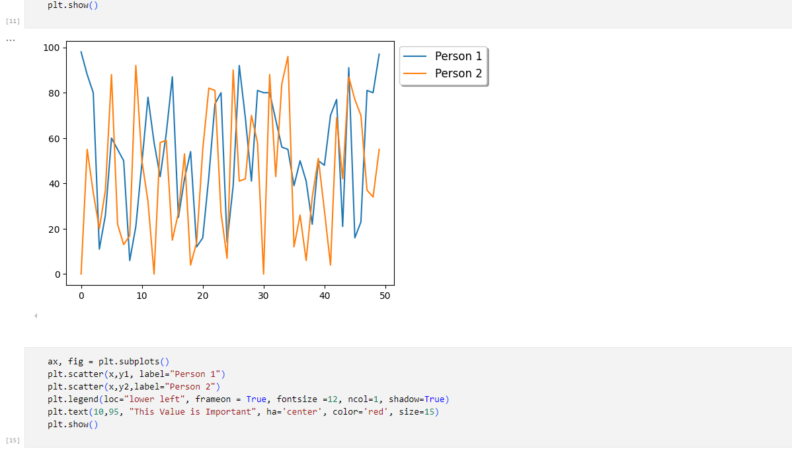
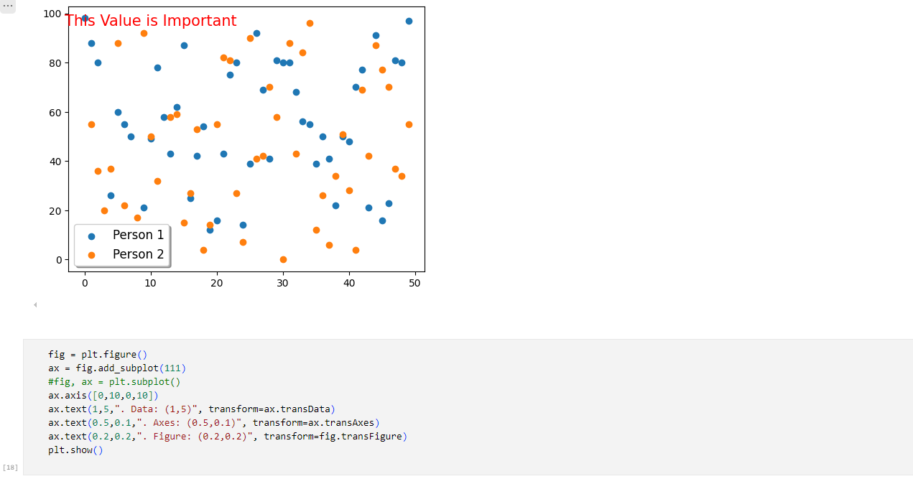
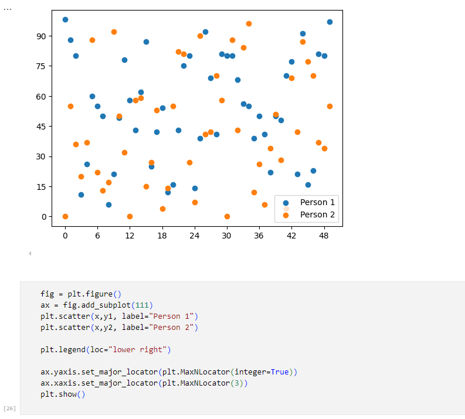
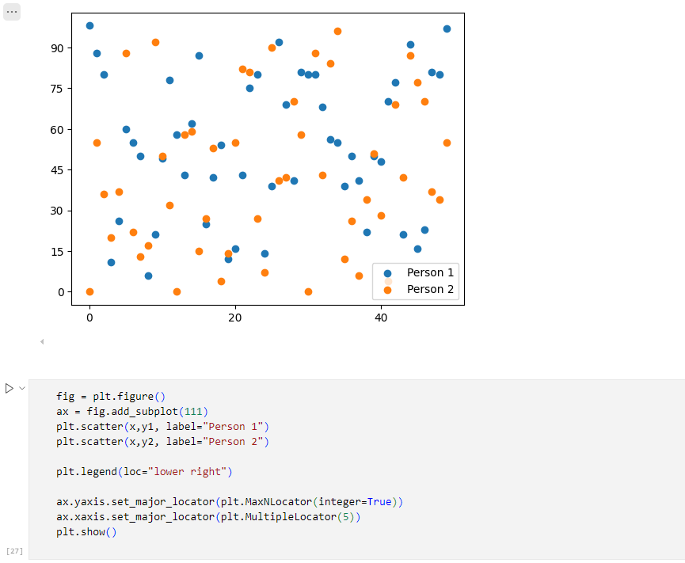
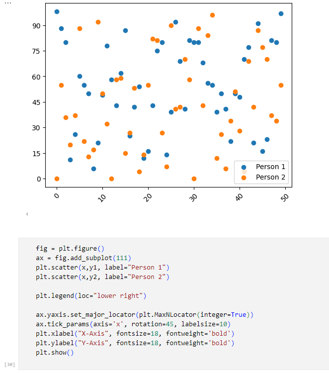
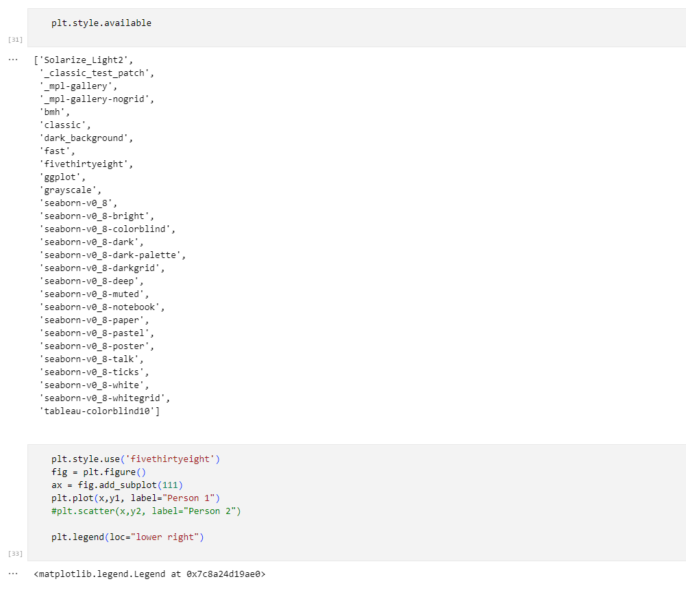
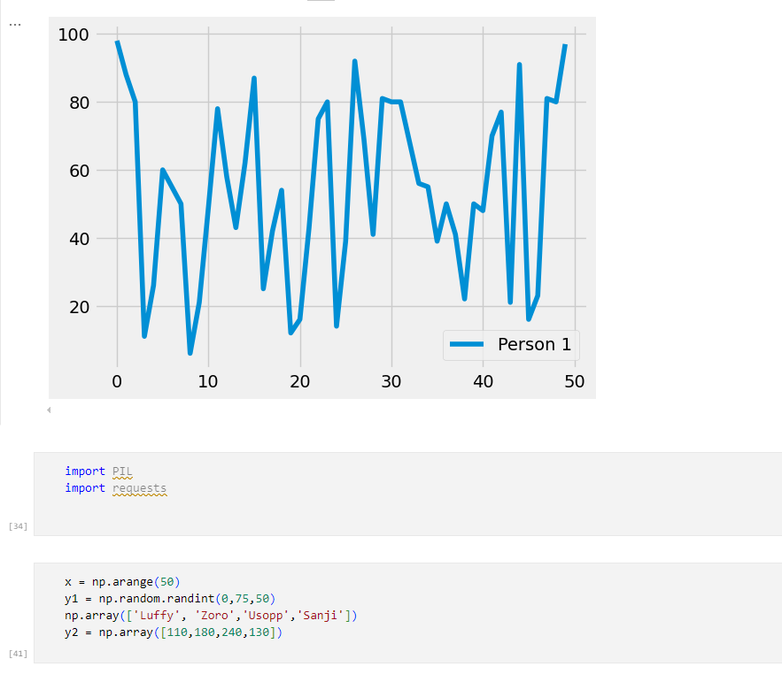

# Data Visualization

## Assignment 1: Participation (Ongoing)

### Requirements:

- During every class, follow along with sample code from the slides. All code that you should be running in Python is formatted as follows:
  
# I used Google colab to run the commands so there may be some code difference

- When there are individual or group activities in submodules, make notes of answers and key points from discussions
- Following each lesson with code, submit a document (either .py or a Jupyter notebook) containing the functioning code from that day's lesson, along with any written notes or comments.

### Why am I doing this assignment?:

- This ongoing assignment ensures active participation in the course, and assesses the learning outcomes:
*	Create and customize data visualizations from start to finish in Python
*	Apply general design principles to create accessible and equitable data visualizations
* Use data visualization to tell a story

### Rubric:

| Component          | Scoring                 | Requirement                                              |
|--------------------|-------------------------|----------------------------------------------------------|
| Completion         | Complete/Incomplete for each class| - All required work from a given class is included in the file |
| Markdown file format | Complete/Incomplete for each class| - File is readable and contains functional code, when needed |

## Submission Information

🚨 **Please review our [Assignment Submission Guide](https://github.com/UofT-DSI/onboarding/blob/main/onboarding_documents/submissions.md)** 🚨 for detailed instructions on how to format, branch, and submit your work. Following these guidelines is crucial for your submissions to be evaluated correctly.

### Note:

* You should make a commit after each session with that lesson's code and notes. Your PR should have the same number of commits as there are sessions. It is important to make the commits to your branch in a timely manner right after each class.

### Submission Parameters:
* Submission Due Date: `last day of class`
* The branch name for your repo should be: `assignment-1`
* What to submit for this assignment:
    * The `participation` folder/directory should be populated with the above mentioned .py/.ipynb files along with any written notes or comments (preferably in .md or .txt format).
* What the pull request link should look like for this assignment: `https://github.com/<your_github_username>/visualization/pull/<pr_id>`
    * Open a private window in your browser. Copy and paste the link to your pull request into the address bar. Make sure you can see your pull request properly. This helps the technical facilitator and learning support staff review your submission easily.

Checklist:
- [ ] Create a branch called `assignment-1`.
- [ ] Ensure that the repository is public.
- [ ] Review [the PR description guidelines](https://github.com/UofT-DSI/onboarding/blob/main/onboarding_documents/submissions.md#guidelines-for-pull-request-descriptions) and adhere to them.
- [ ] Verify that the link is accessible in a private browser window.

If you encounter any difficulties or have questions, please don't hesitate to reach out to our team via our Slack at `#cohort-3-help`. Our Technical Facilitators and Learning Support staff are here to help you navigate any challenges.
