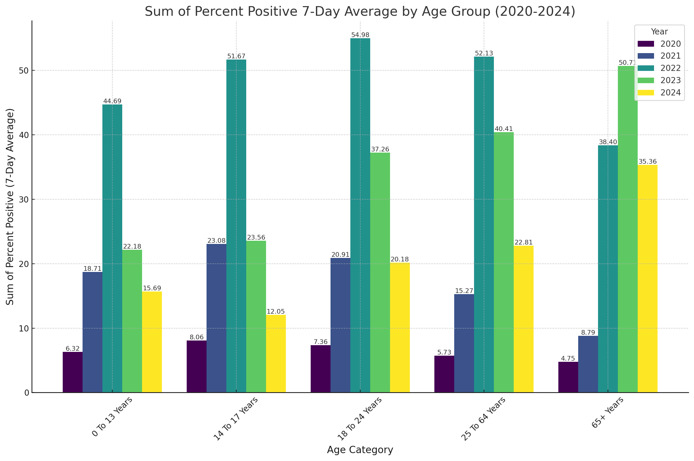

# Data Visualization

## Assignment 2: Good and Bad Data Visualization

### Requirements:

- Data visualizations are important tools for communication and convincing; we need to be able to evaluate the ways that data are presented in visual form to be critical consumers of information 
- To test your evaluation skills, locate two public data visualizations online, one good and one bad  
    - You can find data visualizations at https://public.tableau.com/app/discover or https://datavizproject.com/, or anywhere else you like! 
- For each visualization (good and bad):  
    - Explain (with reference to material covered up to date, along with readings and other scholarly sources, as needed) why you classified that visualization the way you did.
      

    ---------------------------------------------------------

    
      ```
       \
       **CO2 Emissions** above is **a Good Example** for Data Visualization because: \
      1. Itis simple appearance , 2 dimentional plot, not crowded with data \
      2. Easy to understand that China is the largest contributor for CO2 Emissions \
      3. One color is used, made it easy for our brain to process \
      4. data labels is used for more clarity \
      5. scale started from Zero, it is fair comparison \
      6. Horizontal lines used instead of grid or none, that made it easy to figure out the levels \
      CO2 Figure Source:https://www.polymersearch.com/blog/10-good-and-bad-examples-of-data-visualization \
      \
       **Electricity Price Change** is **Bad Example** for Data Visualization for: \
      1. Different Scale is used for year 2013 than previous years \
      2. Tailored to tell different story than real one. \ 
      3. Biased toward **Mariano Rajoy** \
      4. X-Scale was per year for years before 2013, then changed to quarter for 2013, misleading and confuzing. \
      5. Confuzing type of bar charts used. 

    ```
    - How could this data visualization have been improved?  
    ```
   For the Bad example **( Electricity Price Change)**: \
      1.Using Simple Bar Chart  \
      2.Instead of plotting the percentage of change, plot real price for every kilowatt  \
      3. Use same scale for all years (per Year), so Y2013 will judged fairly.  \
      4. Use Horizontal Lines to make easier comparison \
      5. Add data labels on top of each bar \
      6. Use one color for all bars       \
      ```
- Word count should not exceed (as a maximum) 500 words for each visualization (i.e. 
300 words for your good example and 500 for your bad example)

### Why am I doing this assignment?:

- This assignment ensures active participation in the course, and assesses the learning outcomes
* Apply general design principles to create accessible and equitable data visualizations
* Use data visualization to tell a story

### Rubric:

| Component               | Scoring   | Requirement                                                 |
|-------------------------|-----------|-------------------------------------------------------------|
| Data viz classification and justification | Complete/Incomplete | - Data viz are clearly classified as good or bad<br />- At least three reasons for each classification are provided<br />- Reasoning is supported by course content or scholarly sources |
| Suggested improvements  | Complete/Incomplete | - At least two suggestions for improvement<br />- Suggestions are supported by course content or scholarly sources |

## Submission Information

🚨 **Please review our [Assignment Submission Guide](https://github.com/UofT-DSI/onboarding/blob/main/onboarding_documents/submissions.md)** 🚨 for detailed instructions on how to format, branch, and submit your work. Following these guidelines is crucial for your submissions to be evaluated correctly.

### Submission Parameters:
* Submission Due Date: `HH:MM AM/PM - DD/MM/YYYY`
* The branch name for your repo should be: `assignment-2`
* What to submit for this assignment:
    * This markdown file (assignment_2.md) should be populated and should be the only change in your pull request.
* What the pull request link should look like for this assignment: `https://github.com/<your_github_username>/visualization/pull/<pr_id>`
    * Open a private window in your browser. Copy and paste the link to your pull request into the address bar. Make sure you can see your pull request properly. This helps the technical facilitator and learning support staff review your submission easily.

Checklist:
- [ ] Create a branch called `assignment-2`.
- [ ] Ensure that the repository is public.
- [ ] Review [the PR description guidelines](https://github.com/UofT-DSI/onboarding/blob/main/onboarding_documents/submissions.md#guidelines-for-pull-request-descriptions) and adhere to them.
- [ ] Verify that the link is accessible in a private browser window.

If you encounter any difficulties or have questions, please don't hesitate to reach out to our team via our Slack at `#cohort-3-help`. Our Technical Facilitators and Learning Support staff are here to help you navigate any challenges.
