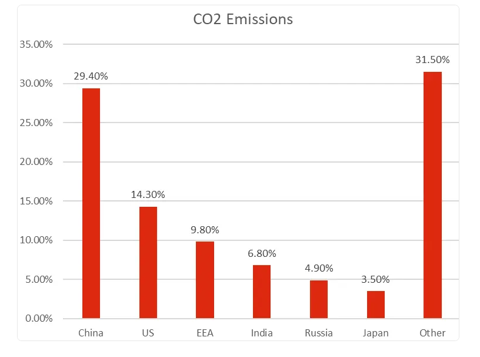
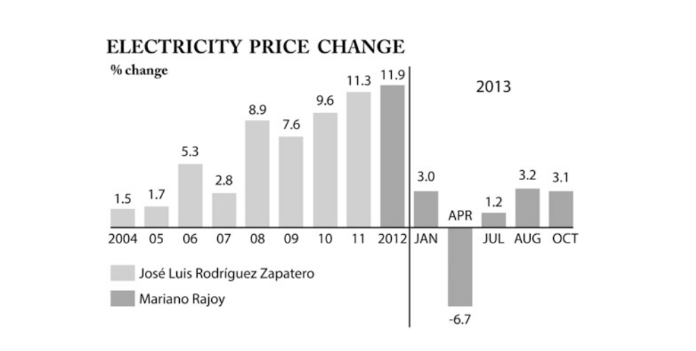

# Data Visualization

## Assignment 3: Data Visualization Ethics

### Requirements:
- Let’s return to the data visualizations we evaluated for Assignment 2.  
- For each visualization: 
    - Explain (with reference to material covered up to date, along with readings and other scholarly sources, as needed) whether or not you think this data visualization is accessible, reproducible, and equitable. 
 

**Visualization 1: CO2 Emissions** \
**Access:**\
**Strengths:**
* Easy to understand for most viewers because it is Bar graph.
* Percentages appear in numbers above each bar, conveying clear numerical values.

**Weaknesses:**
* Red color used to all bars may not be accessible to users with color blindness 
* No alternative labels in the graph for users working with screen readers. 

**Reproducibility:** \
**Strengths:**
* Seems simple enough to replicate if data is available. 

**Weaknesses:**
* No citation to the original data source is provided that limits reproducibility. 
* It is unclear if this data represents annual emissions, or emissions per capita. 

**Equity:** \
**Strengths:** 
* Includes a broad range of countries (China, US, EEA, etc.). 

**Weaknesses:** 
* "The Other" category is too general, at 31.5%, and overshadows the contribution of smaller nations. This masks the role of countries with significant individual contributions.  

**Question-2 - Recommendation -CO2-Example1** \
**Recommendations for Improvement:** 
* Making the color palette colorblind accessible (by not using red or green colors) 
* Adding a title or subtitle that clearly indicates whether this is annual, or per capita CO2 emissions. 
* Adding a citation for where the data comes from. 
* Breaking the "Other" category down into subregions  \

**Visualization 2: Change in Electricity Price**\
**Accessibility:**\
**Strengths:**
* Bars are coloured using a two-tone scheme to show the two different political eras, hence allowing good readability of information visually.

**Weaknesses:**

* There is no legend or explanation on the meanings of the two colour shades; this is determined from the labels only.
* Grayscale scheme may be difficult to read for certain cases of visual impairments
* Labels, particularly the small percentages and years in the graph are difficult to read by low vision users.

**Reproducibility:**

**Strengths:**
* Data appears segmented by year, allowing for easy reproduction if raw data is available.

**Weaknesses:**
* The source of the data is not provided; thus, the analysis can neither be validated nor reproduced.

**Equity:**

**Strengths:**
* An attempt to relate changes in prices to political leadership does provide some equitable context, if supported properly.

**Weaknesses:**
* Lack of context or explanation on what might drive changes-for example, external factors such as economic crises or global oil prices.

**Question-2 - Recommendation Change in Electricity Price Example2**

**Recommendations for Improvement:**
* Adding a legend describing what two shaded bars represent, namely Zapatero and Rajoy periods.
* Using an accessible color palette instead of grayscale to help differentiate the two. 
* Adding source reference so data appears credible. 
* Adding context for what happened on big drop such as April 2013.

- Word count should not exceed (as a maximum) 300 words for each visualization. 

### Why am I doing this assignment?:
- This ongoing assignment ensures active participation in the course, and assesses learning outcomes 2 and 3:  
* Apply general design principles to create accessible and equitable data visualizations
* Use data visualization to tell a story

### Rubric:
| Component               | Scoring   | Requirement                                                 |
|-------------------------|-----------|-------------------------------------------------------------|
| Data viz classification and justification | Complete/Incomplete | - Data viz are clearly classified as good or bad - At least three reasons for each classification are provided - Reasoning is supported by course content or scholarly sources |
| Suggested improvements  | Complete/Incomplete | - At least two suggestions for improvement - Suggestions are supported by course content or scholarly sources |

## Submission Information

🚨 **Please review our [Assignment Submission Guide](https://github.com/UofT-DSI/onboarding/blob/main/onboarding_documents/submissions.md)** 🚨 for detailed instructions on how to format, branch, and submit your work. Following these guidelines is crucial for your submissions to be evaluated correctly.

### Submission Parameters:
* Submission Due Date: `HH:MM AM/PM - DD/MM/YYYY`
* The branch name for your repo should be: `assignment-3`
* What to submit for this assignment:
    * This markdown file (assignment_3.md) should be populated and should be the only change in your pull request.
* What the pull request link should look like for this assignment: `https://github.com/<your_github_username>/visualization/pull/<pr_id>`
    * Open a private window in your browser. Copy and paste the link to your pull request into the address bar. Make sure you can see your pull request properly. This helps the technical facilitator and learning support staff review your submission easily.

Checklist:
- [ ] Create a branch called `assignment-3`.
- [ ] Ensure that the repository is public.
- [ ] Review [the PR description guidelines](https://github.com/UofT-DSI/onboarding/blob/main/onboarding_documents/submissions.md#guidelines-for-pull-request-descriptions) and adhere to them.
- [ ] Verify that the link is accessible in a private browser window.

If you encounter any difficulties or have questions, please don't hesitate to reach out to our team via our Slack at `#cohort-3-help`. Our Technical Facilitators and Learning Support staff are here to help you navigate any challenges.
