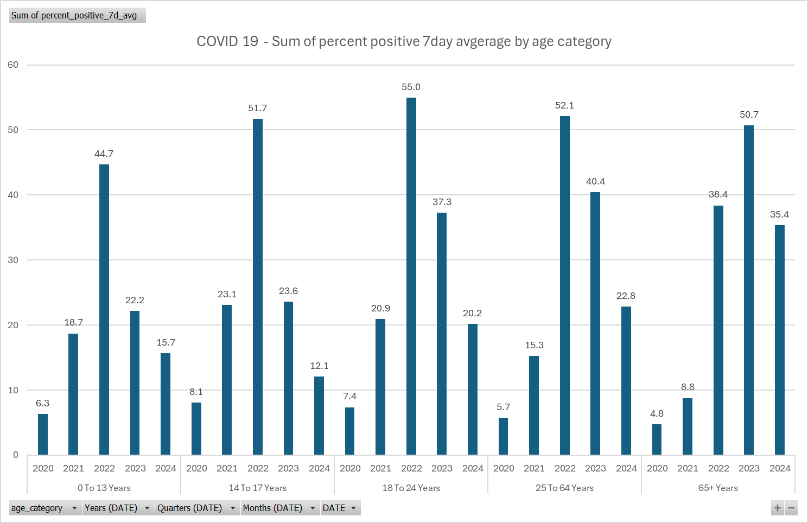

# Data Visualization

## Assignment 4: Final Project

### Requirements:
- We will finish this class by giving you the chance to use what you have learned in a practical context, by creating data visualizations from raw data. 
- Choose a dataset of interest from the [City of Toronto’s Open Data Portal](https://www.toronto.ca/city-government/data-research-maps/open-data/) or [Ontario’s Open Data Catalogue](https://data.ontario.ca/). 
- Using Python and one other data visualization software (Excel or free alternative, Tableau Public, any other tool you prefer), create two distinct visualizations from your dataset of choice.  
- For each visualization, describe and justify: 
    > What software did you use to create your data visualization? \
    the selected data is: ontario-covid-19-testing-percent-positive-by-age-group \
    Excell used to create a figure showing "Sum of percent positive 7day avgerage by age category"\
    
    Used Excel to create interactive data visualization in easy few steps with the apility to do some customization to the appearance, but not fully customizable.
    * I will  python to create simple visualization(not interactive):
    

     

Who is your intended audience? 
* The primary audience for this visualization includes public health officials, and the general public who are interested in understanding trends in COVID-19 testing positivity rates across different age groups over time.
      
What information or message are you trying to convey with your visualization? 
* Message gives insight into how different age groups have been affected by positive test rates during the pandemic, with a focus on trends across multiple years.
    
What design principles (substantive, perceptual, aesthetic) did you consider when making your visualization? How did you apply these principles? With what elements of your plots? 
* **Substantive Principles:**
* Ensure the visualization represents the data accurately. 
Summing up percent-positive averages by year and age group provides an aggregate view of the trends. Grouping by age and using yearly breakdowns helps deliver a clear, comparative story.

* **Perceptual Principles:**

* Accessibility of colors: A colorblind-friendly colormap (viridis) was used to ensure clear distinction for those with color vision deficiencies.
Labeling each bar makes the data more interpretable at a glance.

* **Aesthetic Principles:**

* Grouped bar chart with no redundant visuals was chosen to avoid clutter. 
* Balanced axis scaling and uniform bar widths ensure visual harmony and balance.
    
> How did you ensure that your data visualizations are reproducible? If the tool you used to make your data visualization is not reproducible, how will this impact your data visualization? 
* **Excel Bar Chart:** it is non-reproducible , this would limit the ability of others to validate findings or customize the visualization for their purposes.
* **Python Bar Chart:** 
* Python with libraries like pandas and matplotlib were used, which are widely available, and support reproducibility.
    
> How did you ensure that your data visualization is accessible?  
* **Excel Bar Chart:**
* The use of one that is accessable ensures that the chart is readable by individuals with colorblindness.
* Text labels on top of each bar make the chart accessible to those who may struggle with precise visual comparisons.
* Adequate font sizes for titles, labels ensure readability.
* **Python Bar Chart:**
* The use of the viridis colormap ensures that the chart is readable by individuals with colorblindness.
* Text labels on top of each bar make the chart accessible to those who may struggle with precise visual comparisons.
* Adequate font sizes for titles and labels ensure readability.
    
> Who are the individuals and communities who might be impacted by your visualization?  
* **Public health professionals** can use this to inform age-specific intervention strategies.
* **Communities most affected by COVID-19** can use the visualization to understand how their demographic compares to others.
* **Misinterpretation of the trends** could lead to inappropriate allocation of resources or misinformed policy decisions, impacting vulnerable groups.
    
> How did you choose which features of your chosen dataset to include or exclude from your visualization? 
* **In Both Excel & Python Bars:**
* Included:
* The percent_positive_7d_avg column was chosen to represent the key metric of interest.
* Grouping by year and age categories provides a comprehensive view of how positivity rates vary temporally and demographically.
* Excluded:
* Daily granularity was excluded to reduce noise and focus on macro trends.
* Other columns (e.g., raw testing numbers) were excluded to avoid overloading the visualization with less relevant details.
    
> What ‘underwater labour’ contributed to your final data visualization product?
* Data Cleaning:
* Dates were converted to a standard format, and age group labels were cleaned and standardized for readability.
* Summarization: Aggregating daily data into yearly sums required careful handling to avoid misrepresentation.
* Accessibility Considerations: Thoughtful selection of a colorblind-friendly colormap and label placement added extra steps.
* Verification: Cross-checking sums and trends in the dataset to ensure the visualization aligned with the data’s reality.

Refrence of data:
https://data.ontario.ca/dataset/ontario-covid-19-testing-percent-positive-by-age-group/resource/05214a0d-d8d9-4ea4-8d2a-f6e3833ba471
- This assignment is intentionally open-ended - you are free to create static or dynamic data visualizations, maps, or whatever form of data visualization you think best communicates your information to your audience of choice! 
- Total word count should not exceed **(as a maximum) 1000 words** 
 
### Why am I doing this assignment?:  
- This ongoing assignment ensures active participation in the course, and assesses the learning outcomes: 
* Create and customize data visualizations from start to finish in Python
* Apply general design principles to create accessible and equitable data visualizations
* Use data visualization to tell a story  
- This would be a great project to include in your GitHub Portfolio – put in the effort to make it something worthy of showing prospective employers!

### Rubric:

| Component         | Scoring  | Requirement                                                                 |
|-------------------|----------|-----------------------------------------------------------------------------|
| Data Visualizations | Complete/Incomplete | - Data visualizations are distinct from each other - Data visualizations are clearly identified - Different sources/rationales (text with two images of data, if visualizations are labeled) - High-quality visuals (high resolution and clear data) - Data visualizations follow best practices of accessibility |
| Written Explanations | Complete/Incomplete | - All questions from assignment description are answered for each visualization - Explanations are supported by course content or scholarly sources, where needed |
| Code              | Complete/Incomplete | - All code is included as an appendix with your final submissions - Code is clearly commented and reproducible |

## Submission Information

🚨 **Please review our [Assignment Submission Guide](https://github.com/UofT-DSI/onboarding/blob/main/onboarding_documents/submissions.md)** 🚨 for detailed instructions on how to format, branch, and submit your work. Following these guidelines is crucial for your submissions to be evaluated correctly.

### Submission Parameters:
* Submission Due Date: `HH:MM AM/PM - DD/MM/YYYY`
* The branch name for your repo should be: `assignment-4`
* What to submit for this assignment:
    * A folder/directory containing:
        * This file (assignment_4.md)
        * Two data visualizations 
        * Two markdown files for each both visualizations with their written descriptions.
        * Link to your dataset of choice.
        * Complete and commented code as an appendix (for your visualization made with Python, and for the other, if relevant) 
* What the pull request link should look like for this assignment: `https://github.com/<your_github_username>/visualization/pull/<pr_id>`
    * Open a private window in your browser. Copy and paste the link to your pull request into the address bar. Make sure you can see your pull request properly. This helps the technical facilitator and learning support staff review your submission easily.

Checklist:
- [ ] Create a branch called `assignment-4`.
- [ ] Ensure that the repository is public.
- [ ] Review [the PR description guidelines](https://github.com/UofT-DSI/onboarding/blob/main/onboarding_documents/submissions.md#guidelines-for-pull-request-descriptions) and adhere to them.
- [ ] Verify that the link is accessible in a private browser window.

If you encounter any difficulties or have questions, please don't hesitate to reach out to our team via our Slack at `#cohort-3-help`. Our Technical Facilitators and Learning Support staff are here to help you navigate any challenges.
